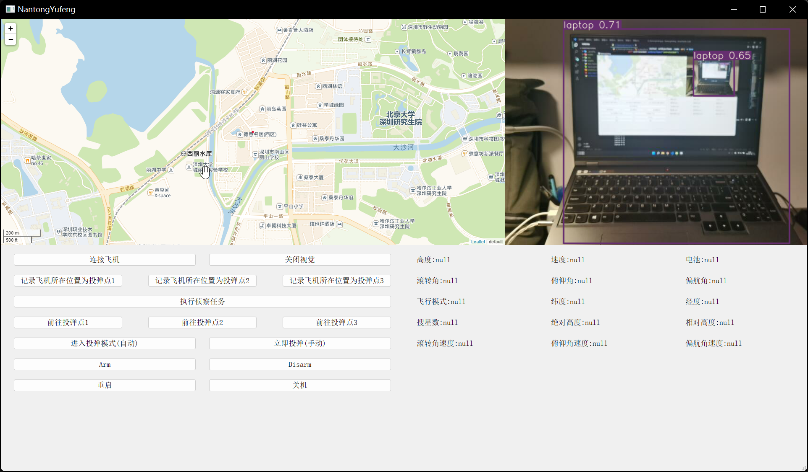
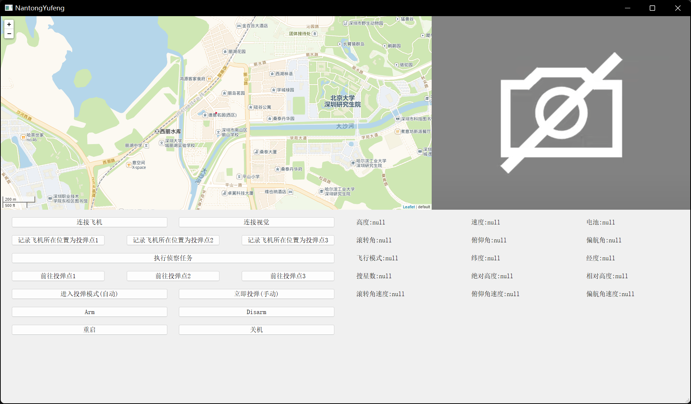

# 对地任务的实现  
## [认真做的地面站v1.0(NantongYufeng)](NantongYufeng)  
- 目前进度     
- 它将实现:  
  - 一键启动, 各功能集合为一体  
  - 左上实现地图功能  
  - 地图添加航迹与目标点显示  
  - 右上显示视觉模块  
  - 实现前端与后端分离  
  - 飞行数据实时刷新  
  - You tell me.  
## ~~[瞎做的地面站v0.1(flight_control)](flight_control)~~  
- ~~[fly.py](flight_control/fly.py)使用按键监听并且没有图形化界面~~  
- ~~[fly_pygame_control.py](flight_control/fly_pygame_control.py)使用图形化界面控制飞机~~
- ~~[fly_pygame_control_windows.py](flight_control/fly_pygame_control_windows.py))在windows运行新增arm和bomb按钮, 运行时需手动启动mavsdk_server~~
  - ~~e.g. 在终端中打开`flight_control\mavsdk-windows-x64-release\bin` 目录~~
  - ~~在终端中执行```./mavsdk_server_bin -p 50051 serial://COM6:57600```~~ 
## vision中包含视觉识别项目
- [detect_v1.py](vision/detect_v1.py)实现了投弹接口与连接。检测到目标在以中心点为圆心，25像素为半径的圆内时，进行投弹。  
## demo中包含部分部件的demo  